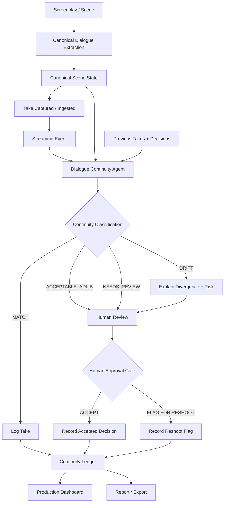
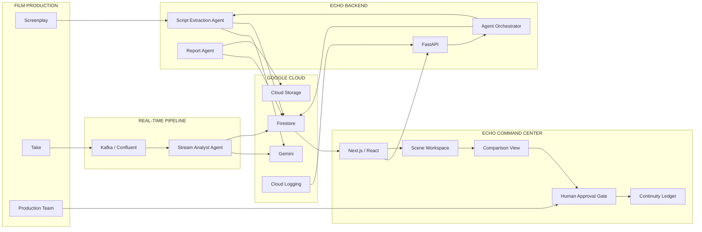

<div align="center">

# ◈ ECHO

### REAL-TIME DIALOGUE CONTINUITY AGENT FOR FILM PRODUCTION

**Catch the line that breaks continuity — while you're still on set.**

[](https://echo-frontend-jk2f.onrender.com)
[](https://github.com/rahulsharma767/ECHO)
[](LICENSE)
[](https://cloud.google.com/)

**AI · Streaming · Human-in-the-Loop · Cinema**

</div>

---
## 🏆 Hackathon Submission

**Hackathon:**  Agentic Cinema: The Blockbuster Hackathon  
**Track:** **IBM Track — IBM Bob**  
**Category:** Agentic AI for Cinema / Film Production  
**Project:** **ECHO — Real-Time Dialogue Continuity Agent**  
**Team:** Sohana Pilli · Tejaswee Rajput · Rahul Sharma · Shreya Dubey  


# 🎬 ECHO

## Real-Time Dialogue Continuity Agent for Film Production

Film production is built around takes.

Actors repeat the same scene multiple times. Small changes in dialogue are normal. A word gets added. A phrase gets shortened. An actor improvises.

The problem isn't that dialogue changes.

**The problem is discovering the continuity consequence after the set is already gone.**

ECHO is an on-set dialogue continuity agent that compares each take against the canonical screenplay and prior takes, identifies meaningful dialogue drift, explains the divergence, and routes the result through a human approval workflow.

> **ECHO catches continuity problems while you can still fix them.**

---

# 🎯 The Problem

A scene can be technically captured perfectly and still become difficult to edit because dialogue has changed between takes.

Consider:

### Canonical Script

> "I never trusted him."

### Take

> "I never really trusted him."

The difference is only one word.

But that one word can change:

- rhythm
- emphasis
- timing
- actor performance
- edit points
- intercutting compatibility

By the time an editor discovers the problem in post-production:

- the actors may have left
- the location may be unavailable
- lighting may have changed
- production may have moved on
- a reshoot may become expensive

Traditional continuity workflows are largely retrospective.

**ECHO moves dialogue continuity intelligence to the moment of capture.**

---

# 💡 The Solution

ECHO creates a real-time continuity loop around every take:

```text
SCREENPLAY
    ↓
CANONICAL SCENE
    ↓
TAKE ARRIVES
    ↓
DIALOGUE ANALYSIS
    ↓
CONTINUITY CLASSIFICATION
    ↓
EXPLAINABLE RESULT
    ↓
HUMAN DECISION
    ↓
CONTINUITY LEDGER
```

Instead of simply saying:

> "These sentences are different."

ECHO asks:

> **"Is this difference meaningful for continuity, and what should the production team do about it?"**

---

# 🧠 Core Insight

ECHO deliberately separates:

```text
AI CLASSIFICATION
        ≠
PRODUCTION DECISION
```

The AI identifies potential continuity risk.

The production team decides what happens next.

This creates a **human-in-the-loop production workflow** rather than an autonomous system that silently declares takes unusable.

---

# ⚡ What ECHO Does

For every take, ECHO considers:

1. **Canonical script**
   - What the screenplay says.

2. **Current take**
   - What the actor actually said.

3. **Previous takes**
   - What has already been recorded.

4. **Continuity context**
   - Whether the difference is meaningful for intercutting.

5. **Production decision**
   - Whether the take should be accepted or flagged.

ECHO classifies dialogue into four production states:

| State | Meaning | Action |
|---|---|---|
| `MATCH` | Dialogue preserves the reference | Continue |
| `ACCEPTABLE_ADLIB` | Wording differs but remains plausibly intercuttable | Human review |
| `DRIFT` | Meaningful dialogue continuity risk detected | Explain + review |
| `NEEDS_REVIEW` | Confidence or context is insufficient | Human review |

ECHO does **not** automatically force a reshoot.

### AI detects. Humans decide.

---

# 🔄 End-to-End Workflow



---

# 🏗️ System Architecture



---

# 🔬 The Agentic Loop

ECHO is not designed as a chatbot.

It is designed as a **stateful production workflow**.

```text
                ┌────────────────────┐
                │     SCREENPLAY     │
                └─────────┬──────────┘
                          ↓
                ┌────────────────────┐
                │ CANONICAL SCENE    │
                │      STATE         │
                └─────────┬──────────┘
                          ↓
                ┌────────────────────┐
                │    TAKE ARRIVES    │
                └─────────┬──────────┘
                          ↓
                ┌────────────────────┐
                │   ECHO ANALYZER    │
                └─────────┬──────────┘
                          ↓
                ┌────────────────────┐
                │   CLASSIFICATION   │
                └─────────┬──────────┘
                          │
          ┌───────────────┼────────────────┐
          ↓               ↓                ↓
       MATCH       ACCEPTABLE_ADLIB      DRIFT
          │               │                │
          ↓               ↓                ↓
         LOG        HUMAN REVIEW      EXPLAIN RISK
                          │                │
                          └────────┬───────┘
                                   ↓
                         ┌──────────────────┐
                         │ HUMAN APPROVAL   │
                         └────────┬─────────┘
                                  │
                     ┌────────────┴────────────┐
                     ↓                         ↓
                  ACCEPT                FLAG RESHOOT
                     │                         │
                     └────────────┬────────────┘
                                  ↓
                         ┌──────────────────┐
                         │ CONTINUITY       │
                         │ LEDGER           │
                         └──────────────────┘
```

The agent does not end at prediction.

It continues through:

**analysis → explanation → human decision → persistent production state**

---

# 🎥 Hero Demonstration — SC14

The repository includes a deterministic SC14 scenario demonstrating the complete continuity decision loop.

## Canonical Dialogue

> **"I never trusted him."**

---

## Take 1 — `MATCH`

```text
I never trusted him.
```

### Result

```text
MATCH
```

No meaningful divergence.

### Production Action

Continue.

---

## Take 2 — `ACCEPTABLE_ADLIB`

```text
I didn't trust him.
```

The wording changes, but the variation remains close enough to be considered potentially intercuttable.

### Result

```text
ACCEPTABLE_ADLIB
```

### Production Action

Human review.

---

## Take 3 — `DRIFT`

```text
I never really trusted him.
```

ECHO isolates the meaningful divergence:

```text
I never [really] trusted him.
          ^^^^^^
```

### Result

```text
DRIFT
```

### Production Action

```text
              HUMAN APPROVAL GATE
                       │
             ┌─────────┴─────────┐
             ↓                   ↓
          ACCEPT          FLAG FOR RESHOOT
```

---

## Take 4 — `NEEDS_REVIEW`

ECHO also supports an uncertainty path:

```text
NEEDS_REVIEW
```

Instead of pretending every model output is certain, ambiguous cases are routed to the production team.

---

# 🎬 Why the SC14 Demo Matters

The demo intentionally shows multiple outcomes:

```text
TAKE 1
   ↓
MATCH
   ↓
NO INTERVENTION


TAKE 2
   ↓
ACCEPTABLE_ADLIB
   ↓
HUMAN JUDGMENT


TAKE 3
   ↓
DRIFT
   ↓
EXPLAIN DIVERGENCE
   ↓
HUMAN APPROVAL
   ↓
ACCEPT / RESHOOT
```

This demonstrates that ECHO is not a simple string-difference detector.

It models the actual production decision problem:

> **Which dialogue differences matter?**

---

# 🖥️ Product Experience

ECHO is intentionally an:

> **On-set dialogue-continuity operations dashboard — not a chatbot.**

The product is organized around the workflow of a film production team.

---

## 1. Scene List

Production teams can view the scenes currently being monitored.

---

## 2. Scene Workspace

A selected scene becomes the operational workspace for incoming takes.

---

## 3. Take Processing

The interface exposes the state of a take as it moves through the continuity pipeline.

---

## 4. Comparison View

The system makes the dialogue divergence visible.

Instead of forcing the user to compare entire sentences manually:

```text
I never [really] trusted him.
          ^^^^^^
```

ECHO focuses attention on the relevant change.

---

## 5. Human Approval Gate

The production team can explicitly decide:

```text
ACCEPT
```

or

```text
FLAG FOR RESHOOT
```

---

## 6. Continuity Ledger

The decision is persisted as part of the scene's continuity history.

The useful output is therefore not simply:

> "Take 3 was different."

It becomes:

> "Take 3 was flagged for dialogue drift, reviewed by the production team, and the final decision was recorded."

---

# ☁️ Google Cloud + Gemini

ECHO uses Google Cloud and Gemini as part of its application architecture.

Key components include:

### Gemini

Used for AI-powered dialogue and screenplay analysis paths.

### Firestore

Used for persistent scene, take, classification, and decision state.

### Cloud Storage

Used through the storage adapter for generated artifacts and reports.

### Cloud Logging

Used for structured backend logging and operational visibility.

### Application Default Credentials

Used for Google Cloud authentication in cloud-enabled development and deployment environments.

---

# 🔌 Real-Time Streaming Architecture

ECHO is designed around an event-driven pipeline:

```text
TAKE
 ↓
TRANSCRIPT EVENT
 ↓
KAFKA / CONFLUENT
 ↓
STREAM ANALYST AGENT
 ↓
GEMINI
 ↓
VALIDATED CLASSIFICATION
 ↓
FIRESTORE
 ↓
ECHO DASHBOARD
```

This separates:

- event ingestion
- analysis
- persistence
- presentation

and allows the system to evolve from a deterministic demonstration into a production streaming architecture.

---

# 🧠 Semantic Continuity

A naive continuity system might do:

```python
if script != take:
    drift = True
```

That would be unusable.

Actors naturally:

- paraphrase
- shorten phrases
- add words
- change emphasis
- improvise

Therefore ECHO distinguishes between:

```text
EXACT MATCH
      ↓
SEMANTICALLY ACCEPTABLE VARIATION
      ↓
MEANINGFUL CONTINUITY DRIFT
```

The objective is not to punish improvisation.

The objective is to identify improvisation that may create a **continuity problem**.

---

# 🛡️ Human-in-the-Loop Safety

ECHO deliberately does not make irreversible production decisions automatically.

The architecture is:

```text
AI
 ↓
CLASSIFICATION
 ↓
EXPLANATION
 ↓
HUMAN REVIEW
 ↓
PRODUCTION DECISION
```

The production team can account for factors an automated system may not know:

- actor intention
- director preference
- editorial style
- performance quality
- planned improvisation
- scene context
- production constraints

The AI provides a second set of eyes.

The production team remains in control.

---

# 🧾 Continuity Ledger

The Continuity Ledger is a core part of the product.

It preserves:

```text
Scene
 ↓
Take
 ↓
Observed Dialogue
 ↓
Classification
 ↓
Divergence
 ↓
Reason
 ↓
Human Decision
```

This creates an auditable continuity record that can later support:

- production review
- editorial handoff
- continuity reporting
- reshoot decisions
- post-production investigation

---

# 🧪 Reliability & Failure Handling

A real-time production system cannot treat failures as ordinary prediction errors.

ECHO includes explicit handling for cases such as:

- duplicate events
- malformed Kafka messages
- malformed model output
- classifier retries
- timeout paths
- low-confidence results
- out-of-order events
- Firestore failures
- scene/character memory isolation
- idempotent take persistence

The principle is simple:

> **A transient infrastructure or model failure should never silently become a production decision.**

---

# 🏛️ Repository Structure

```text
ECHO/
│
├── frontend/
│   ├── src/
│   │   ├── components/
│   │   ├── lib/
│   │   └── types/
│   │
│   ├── ECHO_Master_Playbook.pdf
│   ├── QUICKSTART.txt
│   ├── MANIFEST.txt
│   └── README.md
│
├── person-a/
│   ├── agents/
│   ├── streaming/
│   ├── data/
│   └── tests/
│
├── person-b/
│   ├── agents/
│   ├── backend/
│   ├── data/
│   ├── reports/
│   ├── infra/
│   └── tests/
│
├── docker-compose.yml
├── render.yaml
├── DEPLOY_RENDER.md
├── LICENSE
└── README.md
```

---

# 🚀 Quick Start

## Option A — Hosted Demo

### Live Application

https://echo-frontend-jk2f.onrender.com

Recommended judging flow:

```text
Scenes
  ↓
SC14
  ↓
Take 1
  ↓
Take 2
  ↓
Take 3
  ↓
Comparison View
  ↓
Review "really"
  ↓
Human Approval Gate
  ↓
Accept / Flag for Reshoot
  ↓
Continuity Ledger
```

---

# 💻 Local Frontend

## Requirements

- Node.js 20.9+
- npm

## Install

```bash
git clone https://github.com/rahulsharma767/ECHO.git
cd ECHO/frontend
npm install
```

## Development

```bash
npm run dev
```

Open:

```text
http://localhost:3000
```

The application redirects to:

```text
/scenes
```

## Production Build

```bash
npm run lint
npm run build
npm start
```

---

# 🎬 Run the Hero Demo

Open:

```text
/scenes/SC14
```

Run:

```text
Take 1 → Take 2 → Take 3
```

Expected behavior:

```text
Take 1
MATCH

"I never trusted him."

        ↓

Take 2
ACCEPTABLE_ADLIB

"I didn't trust him."

        ↓

Take 3
DRIFT

"I never really trusted him."
             ^^^^^^
             really

        ↓

Human Approval Gate

    ├── ACCEPT
    └── FLAG FOR RESHOOT

        ↓

Continuity Ledger
```

---

# 🐍 Person A — Streaming Pipeline

Person A implements the real-time dialogue analysis path:

```text
Confluent Kafka
      ↓
Transcript Event
      ↓
Stream Analyst Agent
      ↓
Gemini
      ↓
Validated Classification
      ↓
Firestore
```

## Install

```bash
cd person-a

python -m venv .venv
```

### Windows

```powershell
.venv\Scripts\Activate.ps1
```

### macOS / Linux

```bash
source .venv/bin/activate
```

```bash
pip install -r requirements.txt
```

## Run Tests

```bash
python -m pytest -q
```

The test suite covers:

- event schema validation
- classifier output validation
- retry handling
- scene/character memory isolation
- idempotency
- malformed input
- timeout/failure routing
- low-confidence cases
- out-of-order events
- mocked end-to-end pipeline behavior

---

# 🧪 Person A — Local Deterministic Demo

```bash
python3 -c "
from streaming.producer import load_demo_events
from streaming.consumer import TranscriptConsumer
from agents.classifier import FakeDialogueClassifier
from streaming.firestore_writer import FakeResultStore

consumer = TranscriptConsumer(
    classifier=FakeDialogueClassifier(),
    result_store=FakeResultStore(),
    settings=object(),
    kafka_consumer=object(),
)

for e in load_demo_events():
    o = consumer.process_raw_message(e.to_json())
    print(e.take_number, o.status, o.diverging_phrase)
"
```

Expected:

```text
1 MATCH None
2 ACCEPTABLE_ADLIB ...
3 DRIFT really
```

---

# 🧱 Person B — Backend

Person B provides:

- script extraction API
- extraction agent
- orchestration layer
- Firestore repository
- deterministic demo fallback
- report generation
- Cloud Storage adapter
- structured logging
- deployment configuration

## Local Setup

```bash
cd person-b

python -m venv .venv
```

### Windows

```powershell
.venv\Scripts\Activate.ps1
pip install -r requirements.txt

$env:ECHO_DEMO_MODE="true"

uvicorn backend.api.main:app --reload --port 8080
```

### macOS / Linux

```bash
python3 -m venv .venv
source .venv/bin/activate

pip install -r requirements.txt

export ECHO_DEMO_MODE=true

uvicorn backend.api.main:app --reload --port 8080
```

Open:

```text
http://127.0.0.1:8080/docs
```

---

# 📜 Script Extraction API

```bash
curl -X POST "http://127.0.0.1:8080/api/scripts/extract" \
  -H "Content-Type: application/json" \
  -d "{\"script_text\":\"SC14\nMARCUS: I never trusted him.\"}"
```

---

# 📊 Report Generation

```bash
curl -X POST "http://127.0.0.1:8080/api/reports/generate" \
  -H "Content-Type: application/json" \
  -d "{\"scene_id\":\"SC14\"}" \
  --output echo_report.pdf
```

---

# 🔐 Environment Variables

Never commit production credentials.

For Google Cloud mode:

```text
GOOGLE_CLOUD_PROJECT=
GOOGLE_CLOUD_LOCATION=
GEMINI_MODEL=
GCS_BUCKET=
```

Person A additionally requires the configured Kafka/Confluent and Gemini credentials described in its environment configuration.

For local development, use Application Default Credentials where applicable.

---

# 🧠 Design Decisions

## 1. Human-in-the-Loop by Default

A continuity system should assist the production team, not silently overrule it.

Therefore:

```text
AI CLASSIFICATION
        ↓
HUMAN REVIEW
        ↓
PRODUCTION DECISION
```

---

## 2. Semantic Continuity Instead of String Equality

ECHO does not assume:

```text
different words = bad take
```

Instead:

```text
Exact Match
      ↓
Meaning-Preserving Variation
      ↓
Potential Continuity Drift
```

---

## 3. Explain the Divergence

A production user should not have to trust an unexplained score.

ECHO surfaces the relevant divergence and provides a continuity-oriented explanation.

---

## 4. Persist the Decision

The valuable output is not only a model prediction.

It is:

```text
TAKE
 ↓
ANALYSIS
 ↓
DECISION
 ↓
RECORDED CONTINUITY STATE
```

That is why the Continuity Ledger is a first-class product component.

---

## 5. Deterministic Demo + Cloud-Ready Interfaces

The hackathon demonstration must be reproducible.

ECHO therefore separates:

```text
PRODUCT UI
      ↓
WORKFLOW CONTRACT
      ↓
DATA SOURCE
```

This allows deterministic demonstration data while retaining interfaces for live Gemini, Firestore, streaming, storage, and deployment.

---

# 📊 What Makes ECHO Different

| Traditional Dialogue Tool | ECHO |
|---|---|
| Transcribes dialogue | Tracks dialogue continuity |
| Evaluates one utterance | Compares script + current + previous takes |
| Returns text / score | Produces a production workflow state |
| Often chat-oriented | Operations-dashboard oriented |
| AI result is the endpoint | AI result starts a human decision |
| May discard history | Builds a continuity ledger |
| Finds textual differences | Explains continuity consequences |
| Primarily post-production oriented | **On-set intervention** |

---

# 🎯 Impact

ECHO targets a narrow but expensive failure mode in film production:

> **A continuity problem that becomes visible only after the opportunity to fix it has passed.**

The intended impact is operational:

- catch dialogue drift earlier
- reduce avoidable continuity surprises
- preserve context across takes
- give production teams an auditable decision trail
- reduce dependence on memory and manual comparison
- move continuity intelligence closer to the moment of capture

ECHO is not trying to replace:

- the director
- the Assistant Director
- the script supervisor
- the editor
- the actors

### ECHO gives the production team a second set of eyes while the scene is still being shot.

---

# 🏆 Hackathon Alignment

ECHO was built for the:

## Google Cloud Agentic Cinema — The Blockbuster Hackathon

The project targets a real entertainment workflow:

```text
SCREENPLAY
    ↓
SCENE STATE
    ↓
TAKE
    ↓
REAL-TIME ANALYSIS
    ↓
CONTINUITY CLASSIFICATION
    ↓
HUMAN DECISION
    ↓
CONTINUITY LEDGER
```

The solution is specifically focused on **cinema and film production**, rather than being a generic conversational AI application.

---

# ⚖️ Judging Criteria Alignment

| Judging Criterion | ECHO Evidence |
|---|---|
| **Technological Implementation** | Gemini, Google Cloud state/storage architecture, streaming pipeline, FastAPI backend, deterministic/live analysis paths |
| **Design** | Production command center, scene workspace, comparison view, human approval gate, continuity ledger |
| **Potential Impact** | Early detection of dialogue continuity risk during filming |
| **Quality of the Idea** | Treating dialogue drift as an on-set production operations problem rather than a generic transcription/chat problem |

---

# 🔌 Partner Track

> **Selected Partner Track:** `<INSERT ACTUAL TRACK>`

> **Partner Runtime Component:** `<INSERT ACTUAL PARTNER INTEGRATION>`

> **Where It Is Used:** `<INSERT FILE / MODULE / WORKFLOW>`

> **Judge Verification:** `<INSERT VERIFICATION STEPS>`

Partner integration should only be claimed when the corresponding partner product/MCP is actually present in the submitted code/runtime.

---

# 📹 Recommended 3-Minute Demo

The hackathon demonstration should prioritize the working product.

## 0:00–0:20 — Problem

Show:

> A tiny dialogue change can be discovered only after the set is gone.

---

## 0:20–0:45 — Product

Open ECHO.

Say:

> "ECHO watches dialogue continuity across takes."

---

## 0:45–1:25 — SC14

Run:

```text
Take 1 → MATCH
Take 2 → ACCEPTABLE_ADLIB
Take 3 → DRIFT
```

---

## 1:25–1:55 — Explainability

Show:

```text
"I never really trusted him."
              ^^^^^^
              really
```

Explain why the divergence matters.

---

## 1:55–2:20 — Human Approval

Show:

```text
ACCEPT
    OR
FLAG FOR RESHOOT
```

---

## 2:20–2:40 — Continuity Ledger

Show that the production decision is preserved.

---

## 2:40–3:00 — Architecture

Show:

```text
Gemini
   +
Google Cloud
   +
Streaming
   +
Continuity Agent
   +
Human Approval
   +
Continuity Ledger
```

End with:

> **Catch continuity problems while you can still fix them.**

---

# 🔭 Roadmap

The hackathon prototype establishes the core workflow.

A production deployment could extend ECHO with:

## Capture

- live speech-to-text
- direct production audio integration
- timecode-aware take ingestion

## Context

- richer scene context
- character state
- blocking/action continuity
- approved script revisions

## Intelligence

- stronger semantic continuity scoring
- confidence calibration
- cross-take reasoning
- configurable production policies

## Infrastructure

- fully managed cloud deployment
- durable event processing
- observability
- multi-scene production workspaces

## Reporting

- richer continuity reports
- searchable take history
- editor-facing exports
- production audit trails

---

# 👥 Team

Built by:

- **Sohana Pilli**
- **Tejaswee Rajput**
- **Rahul Sharma**
- **Shreya Dubey**

---

# 📚 Documentation

The repository includes the ECHO Master Build Playbook and supporting implementation documentation.

The Playbook defines the product workflow and UX principles.

ECHO is intentionally designed as:

> **An on-set dialogue-continuity operations dashboard, not a chatbot.**

---

# ⚖️ Open Source

Released under the **MIT License**.

See [`LICENSE`](LICENSE).

---

# 🔗 Links

### Live Demo

https://echo-frontend-jk2f.onrender.com

### GitHub

https://github.com/rahulsharma767/ECHO

### Devpost

https://devpost.com/software/echo-mdnj9q

### Hackathon

https://agentic-cinema.devpost.com/

---

<div align="center">

# 🎬 Catch the drift before the edit.

### ECHO — Real-Time Dialogue Continuity Agent

**AI detects. Production decides. Continuity remembers.**

</div>
